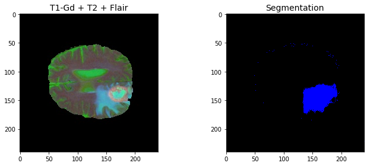
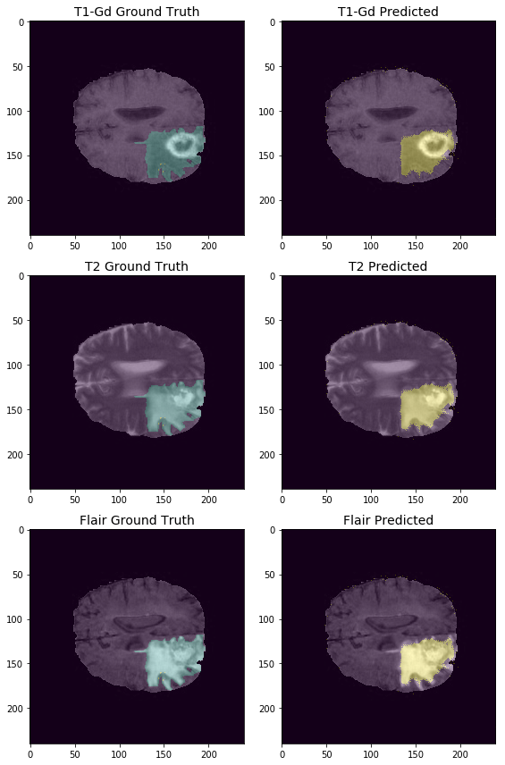
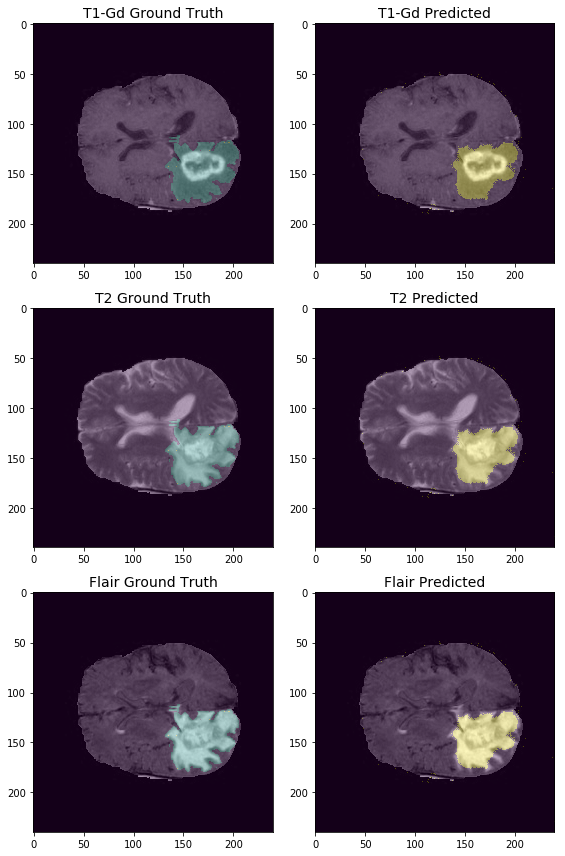

# Tumor Segmentation

## A TensorFlow implementation of U-Net for tumor segmentation using the `tf.estimator` API.

Author: Francisco Gonzalez


This is a simple variation of the U-Net model first proposed by Ronneberger, Fischer, and Brox in
the paper [U-Net: Convolutional Networks for Biomedical Image Segmentation](https://arxiv.org/abs/1505.04597). In this implementation I join three different MRI modalities from pre-operative brain scans and perform binary segmentation (i.e, "tumor" vs. "no-tumor"). Figure 1 shows
an example of an input "image" and the predicted output segmentation.

<p align="center">

<br>
Figure 1. <b>Composite input image and output segmentation</b>
</p>

#### Model Architecture

The basic architecture of the U-Net model is a symmetric convolutional encoder-decoder
model with  residual connections across the network that allow for precise localization.
Figure 1 shows the original architecture proposed in the paper.

<p align="center">

<br>
Figure 2. <b>U-Net architecture</b>
</p>

In this implementation, the size of the model has been reduced (the number of filters
are in the following table).

| Layer      | Filters |
| :--------: | :-----: |
| Conv1      | 16      |
| Conv2      | 32      |
| Conv3      | 64      |
| Conv4      | 128     |
| Conv5      | 256     |
| Conv6      | 128     |
| Conv7      | 64      |
| Conv8      | 32      |
| Conv9      | 16      |
| Conv10     | 1       |


#### Downloading and prepocessing the data

In this implementation I consider the [Cancer Genome Atlas Glioblastoma Multiforme
(TCGA-GBM)](https://wiki.cancerimagingarchive.net/display/Public/TCGA-GBM) data
collection which has segmentation labels and radionomic features for 135 patients.

To download and preprocess the data just run

```bash
cd scripts; python get_data.py
```

##### Training the model

This implementation uses the [tf.estimator
API](https://www.tensorflow.org/guide/estimators), which wraps the model defined by the
`model_fn`. In short, once an estimator object is created, you can train, evaluate, and make
predictions by running `estimator.train(..)`, `estimator.eval(..)`, and `estimator.predict(..)`.

Here, we train and evaluate the model together by running the package as a module

```bash
python -m canseg.main --train_and_eval
```

##### Making predictions

Once the model has trained for a while and has saved some checkpoints, you can make predictions
on the held-out set by running

```bash
python -m canseg.main --predict
```

After training for 20 epochs, I was able to get a **mean IoU of 0.737** for the scans with the
top 25% largest segmentations, and an overall *mean IoU of 0.526*.

**Example 1**

<p align="center">

<br>
Figure 3. <b>Ground truth and predicted segmentation on T1-Gd, T2, and Flair modalities.</b>
</p>

**Example 2**

<p align="center">

<br>
Figure 3. <b>Ground truth and predicted segmentation on T1-Gd, T2, and Flair modalities.</b>
</p>
